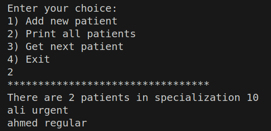

# Hospital System 👩‍⚕️🏥

## Overview
Hospital System is a simple C++ program designed to manage patients in a hospital setting. It enables efficient handling of patients based on their specialization and urgency, allowing doctors to attend to them in a timely manner. This project serves as a learning exercise to enhance your C++ programming skills.

## Features
The Hospital System provides the following features:

1. **Add New Patient**: Add a new patient to the system by specifying their specialization, name, and urgency level (0 for regular, 1 for urgent). Patients are organized in queues based on their urgency.

2. **Print All Patients**: Display a list of patients in each specialization queue who are waiting for a doctor's appointment.

3. **Get Next Patient**: Enable doctors to call the next patient for a consultation. The patient is removed from the queue for the specified specialization.

4. **Exit**: Exit the program gracefully.

## Implementation Details 🛠️

Key implementation details of the project:

- The system can handle up to 20 different specializations, with a maximum of 5 patients per specialization queue.

- Patients are added to the queue based on their urgency. Urgent patients are added to the front of the queue, while regular patients are added to the end.

- The system allows you to print the list of patients waiting in each specialization queue.

- Doctors can call the next patient from a specific specialization, and the patient is removed from the queue.

## Screenshots 📸

Here are some screenshots of the Hospital System in action:

*Adding a new patient.*

*Printing the list of patients.*

*Getting the next patient for consultation.*

