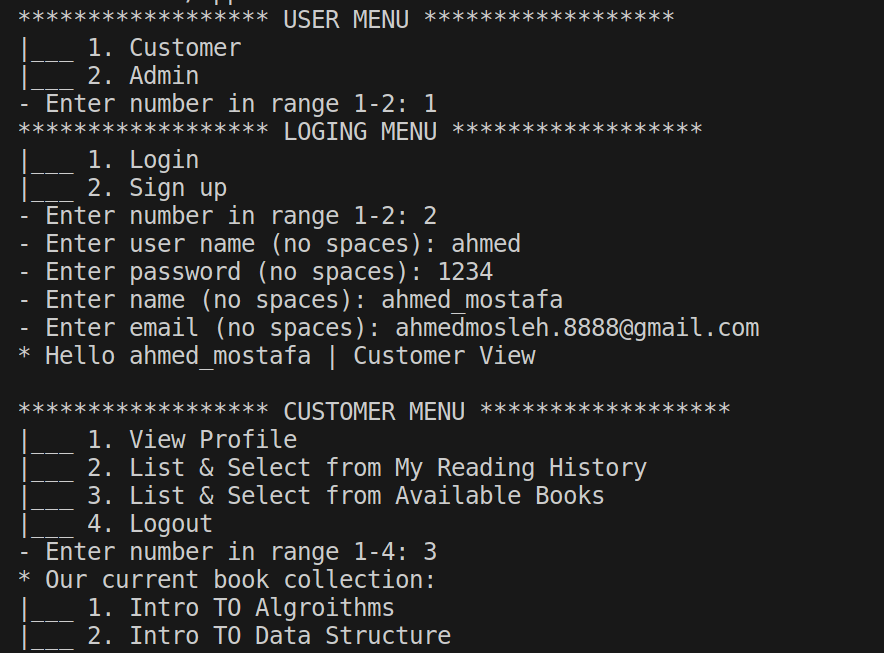
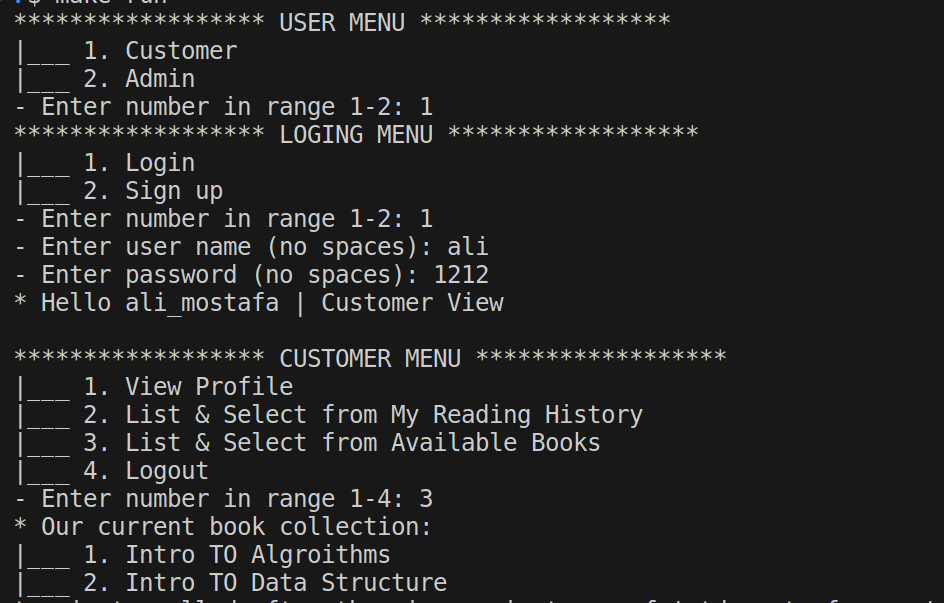

# Online Book Reader Console Application

Welcome to the Online Book Reader Console App! 📚🖥️

## Introduction
This console app lets users read books online, tracking their sessions. Admins add books, and users log in or sign up. No admin signup is needed.

## Functional Requirements
1. **User Authentication:**
   - Admins and Customers can log in or sign up.

2. **Admin Features:**
   - Add books to the system.
   - Activate new user sign-ups.

3. **Customer Features:**
   - Read one book at a time.
   - Maintain a history of reading sessions.

4. **Initialization:**
   - Admins and some initial data are preloaded.
   - Avoid spaces in inputs.

## Getting Started
1. Clone: `git clone https://github.com/your-username/online-book-reader.git`
2. Navigate: `cd online-book-reader`
3. Run: `make run1`

## Future Features
- **Admin:**
  - Edit/Delete/Search books.
  - Logging features.

- **Customer:**
  - Clear all sessions.

- **Design:**
  - Read from files.
  - Parallel sessions.

## Screenshots

*Caption for Screenshot 1.*

*Caption for Screenshot 2.*

## Contributing
Contributions are welcome! Submit issues or pull requests.

## License
This project is under the [Mastering 4 Critical Skills Using C++](https://www.udemy.com/course/cpp-4skills/).
